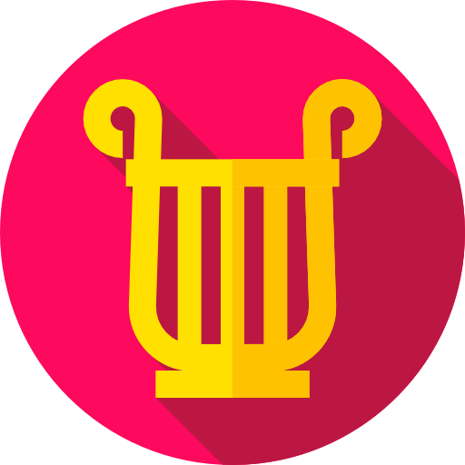

  

<h1>Eurydice</h1>

Eurydice (<b>E</b>metteur <b>U</b>nidirectionnel <b>R</b>edondant de <b>Y</b>ottabit pour le <b>D</b>ialogue <b>I</b>ntergiciel avec <b>C</b>orrection d'<b>E</b>rreur) provides an interface to transfer files through a physical diode using the [Lidi](https://github.com/ANSSI-FR/lidi/) utility.

## 👥 User documentation

See [docs/user.md](docs/user.md).

## 🚧 Development

See [docs/developers.md](docs/developers.md).

## 🚀 Deployment in production & administration

See [docs/administrators.md](docs/administrators.md).

## ▶️ Usage

### 👩‍💻 HTTP API

See documentation directories:

- [Common API documentation](backend/eurydice/common/api/docs/static/).
- [Origin API documentation and code snippets](backend/eurydice/origin/api/docs/static/).
- [Destination API documentation and code snippets](backend/eurydice/destination/api/docs/static/).

## 🙏 Credits

- Logo by [Freepik](https://www.freepik.com)
