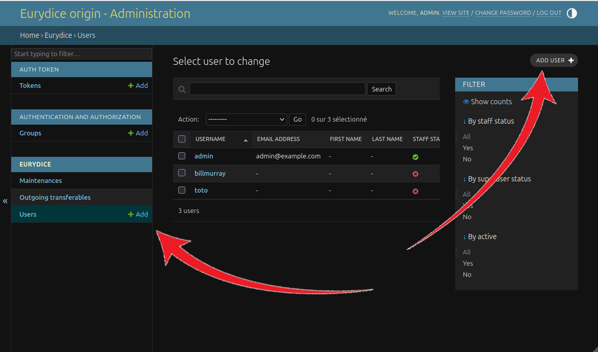
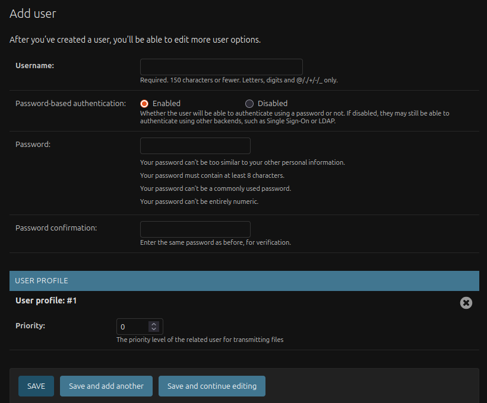
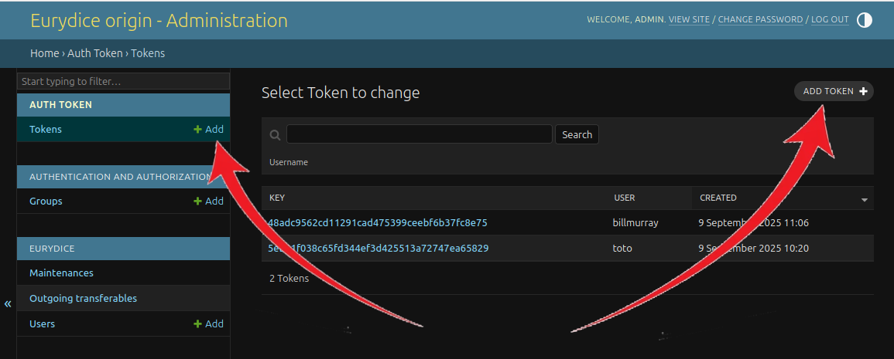
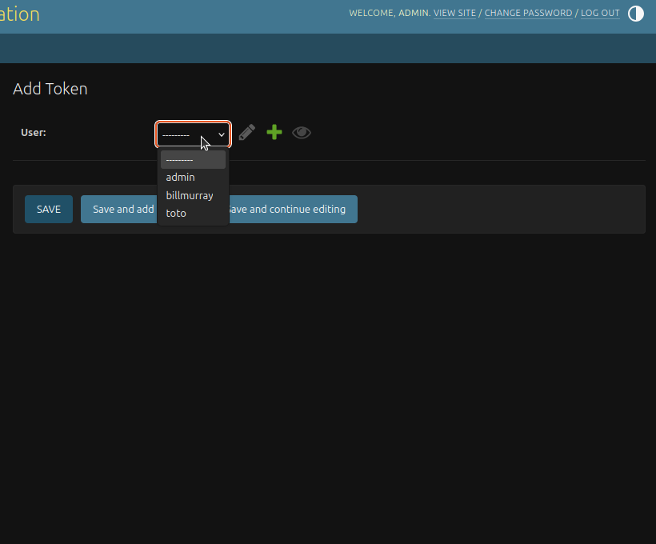

# ☢️ Production

Instructions to deploy Eurydice manually are available below.

## 🔨 Prerequisites

- `Linux environment`
- `make` (you can install it using `sudo apt-get install make`)
- [`docker>=19.03.0`](https://docs.docker.com/engine/install/)
  - support for the compose specification [was added in `19.03.0`](https://docs.docker.com/compose/compose-file/compose-versioning/#compatibility-matrix)
- 2 servers :
  - one for the origin
  - the other one for the destination
  - configure the sysctl and network cards of each server : <https://github.com/ANSSI-FR/lidi/blob/master/doc/tweaking.rst>
- A reverse proxy (see Step 9 for configuration details)
- (Optional) elasticsearch cluster for logs

## 🚀 Deploy in production

### ✨️ Installation

#### Step 1: Create the app folder (both servers)

On **both** servers, create a folder to host the application files (for example /app/eurydice).

#### Step 2: Copy files (both servers)

On **both** servers, copy the following files:

- `.env.prod.example`
- `compose.prod.yml`
- `Makefile`
- (optional) If you use elasticsearch for logs:
  - for origin: `filebeat/filebeat.origin.yml`
  - for destination: `filebeat/filebeat.destination.yml`

#### Step 3: Configure environment file (both servers)

Rename .env.prod.example into .env.

Rename .env.example into .env.
EM_LIMIT_<C
```bash
mv .env.prod.example .env
```

You then will adapt the variables inside the .env file corresponding to your needs (see [env.md](env.md) for more informations about env variables).

#### Step 4: Set up logging

If `LOG_TO_FILE` is true, Eurydice will write additional logs at `${PYTHON_LOGS_DIR}/<service>-logs/log.json`.

This is necessary if you want to process your logs in ELK, so that filebeat may read, process and share applicative logs to a remote elk server.

#### Step 5: Set up PUID, PGID

The `PUID` and `PGID` variables in `.env` file need not be any particular ID, the only requirement is that these UID/GID have read/write permissions on the directories defined in the other variables.

By default `PUID` and `PGID` are set to 1000.

#### Step 6: Create the folders (both servers)

The makefile recipes `create-prod-origin-volumes` and `create-prod-destionation-volumes` will try to import env variables from the `.env` file, and if they (`TRANSFERABLE_STORAGE_DIR`, `DB_DATA_DIR`, `DB_LOGS_DIR`, `FILEBEAT_LOGS_DIR`, `FILEBEAT_DATA_DIR`, `PYTHON_LOGS_DIR`) are not set, default values will be used.

```bash
make create-prod-origin-volumes
make create-prod-destination-volumes
```

#### Step 7: Set correct permissions to folders (both servers)

Set permissions to allow read/write access to these directories for the UID configured in the environment variables (see docker.compose.prod.yml).

#### Step 8: (Optional) Configure Elasticsearch

To send applicative logs into an ELK you need an API key for a user with following role restrictions:

```json
{
  "filebeat_writer": {
    "cluster": ["monitor", "read_ilm", "read_pipeline"],
    "index": [
      {
        "names": ["eurydice-*"],
        "privileges": ["view_index_metadata", "create_doc", "auto_configure"]
      }
    ]
  }
}
```

Go to your Elasticsearch instance and create a new API key with the previous restrictions.

Copy the created key and paste it into the .env :

```bash
ELASTICSEARCH_API_KEY=<your_new_api_key>
```

#### Step 9: (Recommended) Reverse proxy configuration

Eurydice needs to be setup behind a reverse proxy to work securely. Setting up a reverse proxy will also enable authentication at the reverse proxy level rather than relying on the application's authentication mechanism.

The application's services are exposed on localhost by the compose.prod.yml. It is advised to route them like so:

- Web UI at <http://localhost:8888>
  - Should handle requests who don't match the rules for the services below
- API at <http://localhost:8080>
  - Should handle requests whose path is prefixed by /api, /admin and /static

The reverse proxy should also serve all endpoints over TLS. It should also set the X-Forwarded-Proto, X-Forwarded-For and X-Forwarded-Host headers to forward information from the original request to the services.

Examples of Apache configs (for development ONLY) are provided at `deployment/dev/configs/`. You MUST not use this config for production usage.

#### Step 10: (Recommended) Setup remote user header authentication

To do only if you have configured your reverse proxy to manage the authentication.

**Warning: [Django normalizes HTTP headers](https://django.readthedocs.io/en/stable/releases/1.6.10.html#wsgi-header-spoofing-via-underscore-dash-conflation). So it is important to make sure that a user cannot forge an authentication HTTP header that would be considered safe by the reverse proxy, but would in fact be normalized by Django into a valid authentication header**

This risk can be mitigated by configuring which header is used for authenticating the header with the `REMOTE_USER_HEADER` variable.
This environment variable could for example be set to a purely alphanumeric value (not affected by normalization) which could not easily be guessed by the user.
In such a scenario, one would still need to make sure that the reverse proxy correctly prevents users from submitting their own authentication header.

Reverse proxy must setup appropriate authentication mechanisms on specific endpoints (currently `/api/v1/user/login/sso` and `/api/v1/user/login/kerberos`) and then routes requests to `/api/v1/user/login`.

Currently 2 authentication modes are enabled : SSO and Kerberos. If you want to add or remove modes in login page, update `frontend/src/common/views/LoginView.vue`.

Examples of Apache configs (for development ONLY) are provided at `deployment/dev/configs/`. You MUST not use this config for production usage.

#### Step 10: (Alternative without reverse proxy) Set up basic HTTP authentication

**Warning: Basic HTTP authentication passes your credentials over the network as clear text. As such, it is NOT the recommended method of authentication. If you need to run Eurydice using basic auth, at least use HTTPS.**

In case you are unable to setup a reverse proxy and remote user authentication, Eurydice may support [Basic HTTP Authentication](https://developer.mozilla.org/en-US/docs/Web/HTTP/Authentication#basic_authentication_scheme).

Basic HTTP Authentication is enabled when the `REMOTE_USER_HEADER_AUTHENTICATION_ENABLED` variable is set to `false`.

If `REMOTE_USER_HEADER_AUTHENTICATION_ENABLED` is set to `false` the app won't use Remote user headers. Authentication via reverse proxy and basic auth **cannot** be used simultaneously.

#### Step 11: Migrate database

In the rest of the documentation you will have to replace `<profile>` by the following values:

- Logging in filesystem:
  - origin: `origin`
  - destination: `destination`
- Logging in Elasticsearch:
  - origin: `origin-with-elk-logging`
  - destination: `destination-with-elk-logging`

Configure the database by applying the migrations:

- On origin:

```bash
docker compose -f compose.prod.yml --profile <profile> run --rm db-migrations-origin
```

- On destination:

```bash
docker compose -f compose.prod.yml --profile <profile> run --rm db-migrations-destination
```

#### Step 12: Launch the stack

| side / logging type | filesystem logging             | elk logging                           |
|---------------------|--------------------------------|---------------------------------------|
| origin              | `make prod-up-origin`          | `make prod-up-origin-elk`             |
| destination         | `make prod-up-destination`     | `make prod-up-destination-elk`        |


#### Step 13: (Optional) Create an administrator user

If you want to create an administrator user for accessing the admin interface at `/admin`, run the following commands:

- On origin:

```bash
docker compose -f compose.prod.yml exec backend-origin make superuser
```

- On destination:

```bash
docker compose -f compose.prod.yml exec backend-destination make superuser
```

Default credentials are `admin`/`admin`. Update makefile recipe if you want to change these values.

## History management

In some cases, the origin-side database may end up holding millions of Transferable entries. Combined with a long history duration, this may lead to the sender generating enormous quantities of data, just to send the history.

If that happens, you may want to consider using a much smaller history duration, while keeping the same `DBTRIMMER_TRIM_TRANSFERABLES_AFTER`. This will allow you to manually ask the sender to send a complete history only when needed, with the following command:

```bash
docker compose -f compose.prod.yml exec sender python manage.py send_history --duration 7days
```

## Users and their API keys

The admin panel is used to manage the users and their api tokens.

### Prerequisites

- An admin user

_To create the first admin user, refer to **Step 11**_

### Interface

Go to `/admin/login/`. _Note that the trailing `/` is mandatory._


### Create a service user

- To create a service user, go to the `EURYDICE / Users` section and click on the `add` button.



Fill in the information.



### Create an API token

Go to the `AUTH TOKEN / Tokens` section. Click on the `add` button.



Select the user you want to create a token for.



Next, click `save`. A new token is created.

#### Notes

- Users are automatically created during their first login.
- Admin users are the only ones allowed to make another user admin.
- Only one API key can be created per user.

## Encryption & decryption

Automatic file encryption in the browser of the origin side can be activated when sending files from an unprotected network.

Encrypting files from the browser allows storing files on the origin backend without anyone being able to read them. Only the destination backend will have the key to decrypt the data, in a protected network.

### Environment variables

Environment variables are to be set in the .env file. The Django Settings have the same name of variables but not the same use, do not mismatch them. **When ENCRYPTION_ENABLED is at true, don't forget to set the PUBKEY and PRIVKEY PATH variables.**

| Name | Usage | Example |
|---|---|---|
| `ENCRYPTION_ENABLED` | Enables encryption. Defined only on the origin side to know when to encrypt files or not. The destination side only decrypts when receiving encrypted files. | true |
| `PUBKEY_PATH` | Path to the public key used for encryption on the origin side. Path to the key **on the HOST** to mount the volume. **Please copy the generated public key from destination to the origin side so that encryption can use the right key.**| /srv/eurydice/keys/eurydice.pub |
| `PRIVKEY_PATH` | Path to the private key used for decryption on the destination side. Path to the key **on the HOST** to mount the volume. | /srv/eurydice/keys/eurydice |

### Generate keypair

>**Private** key used for decryption must to be placed on the **destination** side.
>**Public** key used for encryption must be placed on the **origin** side.
<br/>
This key must be the one generated and copied from the destination.

#### To generate private and public keys

1. set the environment variables seen above
2. use the following command on the destination side:

  ```bash
  make generate-keys
  ```

3. move the keys where intended by the environment variables in the destination side
4. move the generated public key to the origin side (and set the PUBKEY_PATH from the origin side accordingly)

## Restart the application

To restart the different services, follow the order below so LIDI stays synced.

Origin side
- Activate maintenance mode (wait until ongoing transferables are sent)
  - With ELK `make prod-stop-origin-elk`
  - Without ELK `make prod-stop-origin`

Destination side
- Stop the stack
  - With ELK `make prod-stop-destination-elk`
  - Without ELK `make prod-stop-destination`
- Up the stack
  - With ELK `make prod-up-destination-elk`
  - Without ELK `make prod-up-destination`

Origin side
- With ELK `make prod-up-origin-elk`
- Without ELK `make prod-up-origin`
