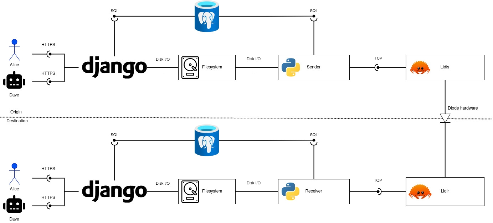
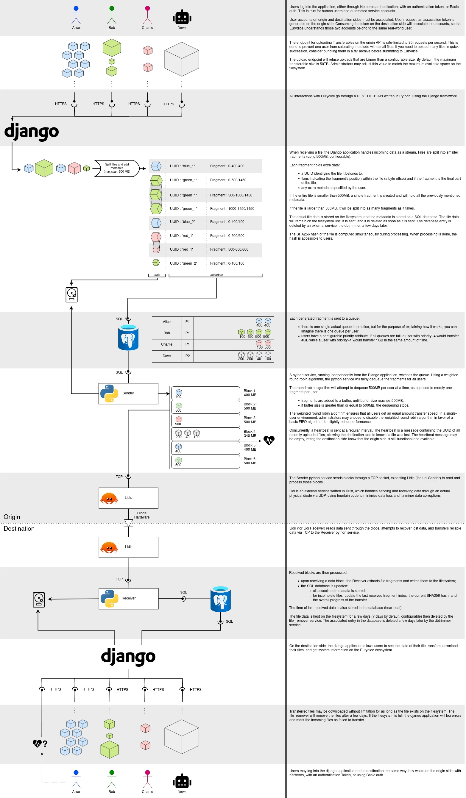

# Architecture

Eurydice is a multi-component system that needs to be deployed on two networks, linked by a unidirectional gateway (diode).

Some components are very similar on both sides, while some are exclusive to one side or the other.

## Eurydice components

Eurydice relies on other technologies and services, but it is, at its core, a python django application.

### Django API

The entrypoint for users to interact with Eurydice. Upload or download Transferables.

Comes with a django-admin backoffice, for superusers to manage users, authentication tokens, and overview Transferables.

### Python services

- **sender**: takes Transferables, sends them to lidi.
- **receiver**: reads TCP data to extract Transferables or handle heartbeats.
- **file_remover**: on the destination side, removes files after a configurable time interval, to make space for the receiver to handle new Transferables.
- **dbtrimmer**: removes database entries that pertain to older, expired Transferables.

### Frontend

A Vue3 frontend application, for users to interact with Eurydice using a browser.

## External components

Those services are part of the [compose.yml](../compose.yml) stack, but not part of the codebase.

### Postgres

Database. Contains applicative data such as user accounts, application metadata, and the list of all Transferables (not their file data).

### Lidi

Lidis for sending from the origin side, Lidir for receiving on the destination side. Handles the traffic between the Eurydice senders and receivers, and the actual physical diode.

### Traefik

Reverse proxy. Routes requests to the frontend or the api.

### Filebeat

Optional. Retrieves all applicative logs and sends them to elastic.

## Interactions between components

The following image depicts how components interact with each other in a typical use case of Eurydice, from one end of the api to the other.

