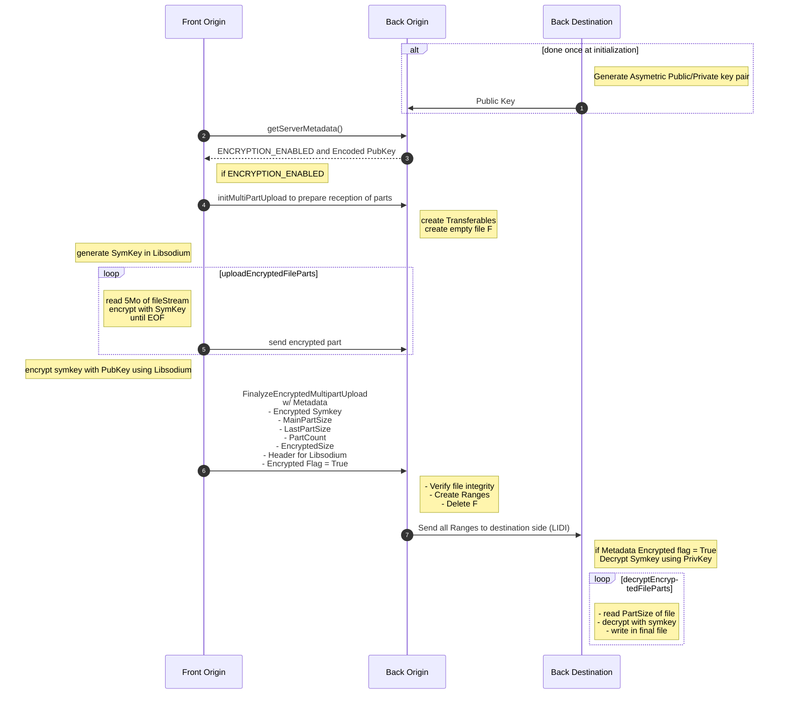

```mermaid
sequenceDiagram;
    autonumber
    participant Front Origin
    participant Back Origin
    participant Back Destination
    alt done once at initialization
      Note right of Back Destination: Generate Asymetric Public/Private key pair
      Back Destination->>Back Origin: Public Key
    end
    Front Origin->>Back Origin: getServerMetadata()
    Back Origin-->>Front Origin: ENCRYPTION_ENABLED and Encoded PubKey
    Note right of Front Origin: if ENCRYPTION_ENABLED
    Front Origin->>Back Origin: initMultiPartUpload to prepare reception of parts
    Note right of Back Origin: create Transferables<br/>create empty file F
    Note left of Front Origin: generate SymKey in Libsodium
    loop uploadEncryptedFileParts
        Note left of Front Origin: read 5Mo of fileStream<br/>encrypt with SymKey<br/>until EOF
        Front Origin->>Back Origin: send encrypted part
    end
    Note left of Front Origin: encrypt symkey with PubKey using Libsodium
    Front Origin->>Back Origin: FinalyzeEncryptedMultipartUpload<br/>w/ Metadata<br/>- Encrypted Symkey<br/>- MainPartSize<br/>- LastPartSize<br/>- PartCount<br/>- EncryptedSize<br/>- Header for Libsodium<br/>- Encrypted Flag = True
    Note right of Back Origin: - Verify file integrity<br/>- Create Ranges<br/>- Delete F
    Back Origin->>Back Destination: Send all Ranges to destination side (LIDI)
    Note right of Back Destination: if Metadata Encrypted flag = True<br/>Decrypt Symkey using PrivKey
    loop decryptEncryptedFileParts
        Note right of Back Destination: - read PartSize of file<br/>- decrypt with symkey<br/>- write in final file
    end
```
