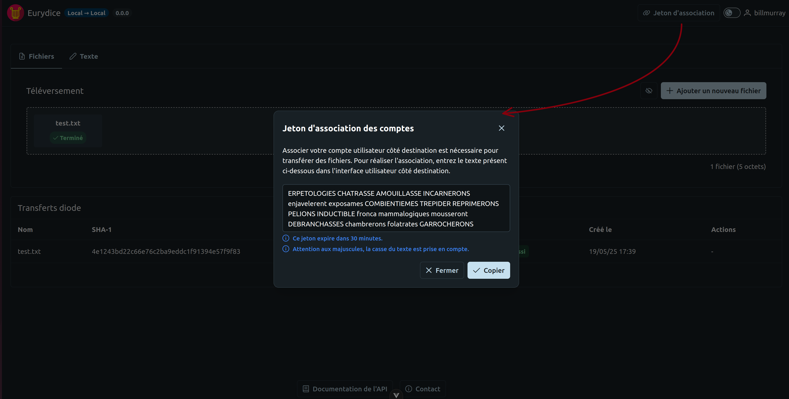
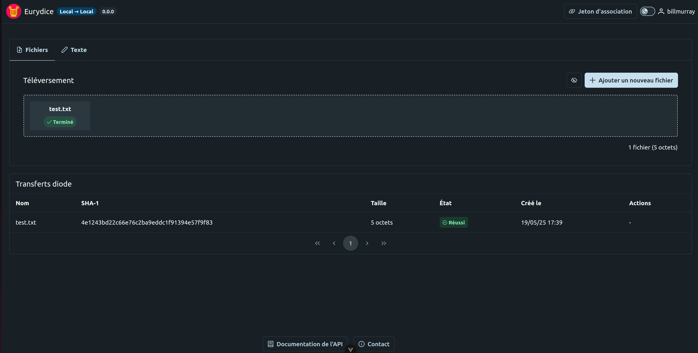
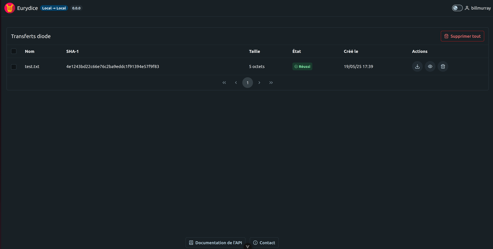
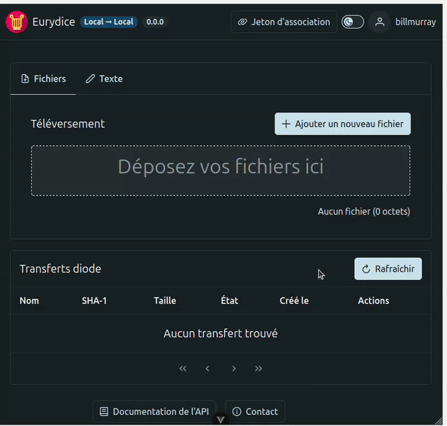

# 👥 User documentation

## Presentation

Eurydice provides a solution to transfer information between two networks of different security level through a physical diode and ensuring data integrity.

In Eurydice, a file transfered through the diode is called a `Transferable`.

## Workflow

Eurydice has two sides:

- The sender side, also called origin ;
- The receiver side, also called destination ;

A file can be sent from the sender side to the receiver side in three steps:

1. Users link the sender side and the receiver side using an association token (a passphrase). The token must be copied from the sender side to the receiver side.

2. From the sender side, users can either import files or paste text directly in the text editor (the text is then sent as a .txt file).

3. Files are received on the receiver side associated with the sender side. Files can be downloaded, deleted and visualized through the interface. The status of each transfer is also available on the receiver side.


## API

A user can get its API token from the GUI by clicking on its username in the header.



The API documentation is accessible at <https://<EURYDICE_URL>/api/docs/>

### Using `curl`

An example using `curl` :

```bash
curl \
  -H "Accept: application/json" \
  -H "Authorization: Token <TOKEN>" \
  "https://<EURYDICE_URL>" \
  --request-target "/api/v1/user/me/"
```

### Using the `cli`

```bash
eurydice-origin workspace create prod https://<EURYDICE_URL> <API_TOKEN>
eurydice-origin workspace use prod
eurydice-origin me
```
